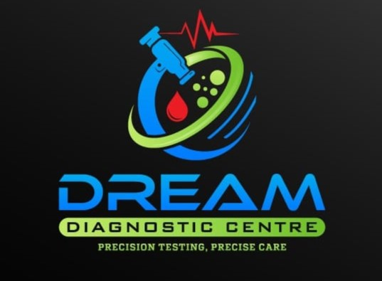

# 🏥 Dream Diagnostic Centre - Modern Web Application

A state-of-the-art, responsive React Single Page Application (SPA) built for **Dream Diagnostic Centre** in Karkala, Karnataka. Features an **iOS Aqua UI** design system, liquid glass refraction cards, interactive health package filters with detail modals, background appointment submissions with custom receipts, a floating glass pill header, and full Dark Mode support.



---

## 🌟 Key Features

- **🎨 iOS Aqua UI Design System**:
  - WebGL liquid refraction filters distorting background elements in real time.
  - Polymer gel buttons with squishy scale animations and specular highlights.
  - Floating central glass pill capsule header on scroll.
- **🌙 Full Dark Mode Support**:
  - Instant theme toggle (Sun/Moon switch) with local storage session persistence (`localStorage`).
  - Deep navy slate canvas (`#0b1329`) with bioluminescent floating bubbles and high-contrast typography.
- **🩺 Interactive Health Packages & Tests Modal**:
  - 16 comprehensive health checkup packages with interactive search filters.
  - **"View Details" Modal**: Frosted-glass overlay listing all clinical test parameters with shield-check indicators.
- **📑 Pre-Test Guidelines & Collapsible FAQs Accordion**:
  - Structured guidelines for fasting duration, daily medications, and sterile sample collections.
  - Accordion FAQ system resolving common patient diagnostic queries.
- **🚑 Home Sample Collection Spotlight**:
  - Dedicated home visit banner with direct WhatsApp scheduling and phone call shortcuts for patients in Karkala.
- **📋 Optimized Booking Experience**:
  - Asynchronous background submission via Formspree (`https://formspree.io/f/manjkzqy`).
  - Dynamic **Patient Receipt UI** with generated Reference ID (`DDC-XXXXXX`), date, time, and package details.
  - Optional WhatsApp chat shortcut to contact clinic coordinators directly.
- **🏭 Laboratory Technology Showcase**:
  - Showcase grid highlighting automated biochemistry, haematology differential counters, and CLIA immunoassay analyzers.

---

## 🚀 Tech Stack

- **Frontend Core**: React 18, Vite 8, JavaScript (ES6+)
- **Routing**: React Router DOM (HashRouter / BrowserRouter)
- **Icons**: Lucide React Icons
- **Styling**: Vanilla CSS (CSS Variables, Flexbox, CSS Grid, SVG Filters, Glassmorphism)
- **Deployment**: Netlify, GitHub Actions

---

## 💻 Local Development

1. **Clone Repository**:
   ```bash
   git clone https://github.com/bharathdnayak/dreamdiagnosticscentre.git
   cd dreamdiagnosticscentre
   ```

2. **Install Dependencies**:
   ```bash
   npm install
   ```

3. **Run Dev Server**:
   ```bash
   npm run dev
   ```

4. **Build Production Bundle**:
   ```bash
   npm run build
   ```

---

## 🌐 Live Website

- **Netlify Deployment**: [https://dreamdiagnosticscentre.netlify.app/](https://dreamdiagnosticscentre.netlify.app/)
- **GitHub Repository**: [https://github.com/bharathdnayak/dreamdiagnosticscentre](https://github.com/bharathdnayak/dreamdiagnosticscentre)

---

© 2026 Dream Diagnostic Centre, Karkala. All Rights Reserved.
